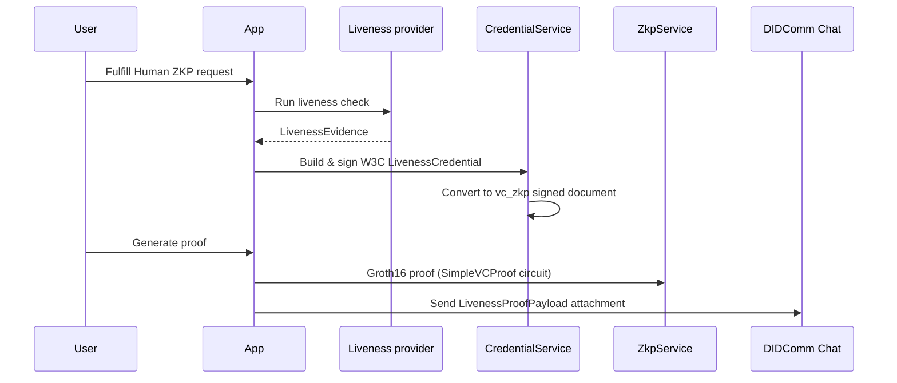

# Affinidi Meeting Place - Reference App for Flutter

This reference application demonstrates the sample usage of the **[Affinidi Meeting Place Core](https://pub.dev/packages/meeting_place_core)** and **[Chat](https://pub.dev/packages/meeting_place_chat)** SDK together with sample integrations (state management, services, infrastructure) in a real Flutter project.

With the use of Affinidi Meeting Place SDK, you can build a messaging appplication that provides a safe and secure method for discovering, connecting, and communicating with others (individuals, businesses, and AI agents) using Decentralised Identifiers (DIDs) and DIDComm v2.1 protocol.

> **IMPORTANT:** This project does not collect or process any personal data. However, when used as part of a broader system or application that handles personally identifiable information (PII), users are responsible for ensuring that any such use complies with applicable privacy laws and data protection obligations.

## Table of Contents

- [Core Concepts](#core-concepts)
- [Preview](#preview)
- [Key Features](#key-features)
- [Architecture Overview](#architecture-overview)
  - [Architectural Layers](#architectural-layers)
  - [Core Components](#core-components)
  - [Access Rules and Data Flow](#access-rules-and-data-flow)
  - [Affinidi Meeting Place SDK Integration](#affinidi-meeting-place-sdk-integration)
  - [Chat Screen Architecture](#chat-screen-architecture)
- [Requirements](#requirements)
- [Getting started](#getting-started)
- [Environment Variables](#environment-variables)
  - [Required Environment Variables](#required-environment-variables)
  - [Optional Environment Variables](#optional-environment-variables)
- [Liveness Credential pipeline](#liveness-credential-pipeline)
  - [Modular architecture](#modular-architecture)
  - [End-to-end flow](#end-to-end-flow)
- [AWS Rekognition Face Liveness setup](#aws-rekognition-face-liveness-setup)
  - [Overview](#overview)
  - [AWS prerequisites](#aws-prerequisites)
  - [AWS console setup](#aws-console-setup)
  - [Amplify configuration](#amplify-configuration)
  - [Native platform setup](#native-platform-setup)
  - [Session lifecycle](#session-lifecycle)
  - [Troubleshooting](#aws-troubleshooting)
- [VSCode Configuration](#vscode-configuration)
- [Run App on Simulator](#run-app-on-simulator)
- [Troubleshooting](#troubleshooting)
- [Support \& Feedback](#support--feedback)
  - [Reporting Technical Issues](#reporting-technical-issues)
- [Contributing](#contributing)
      - [Connect to Control Plane API](#connect-to-control-plane-api)
      - [Connect to DIDComm Mediator](#connect-to-didcomm-mediator)
      - [Enable Push Notifications](#enable-push-notifications)
        - [Firebase iOS App](#firebase-ios-app)
        - [Firebase Android App](#firebase-android-app)
    - [Optional Environment Variables](#optional-environment-variables)
  - [VSCode Configuration](#vscode-configuration)
  - [Run App on Simulator](#run-app-on-simulator)
  - [Troubleshooting](#troubleshooting)
    - [Firebase Configuration Issues](#firebase-configuration-issues)
  - [Support \& Feedback](#support--feedback)
    - [Reporting Technical Issues](#reporting-technical-issues)
  - [Contributing](#contributing)

## Core Concepts

- **Decentralised Identifier (DID):** A globally unique identifier that enables secure interactions. The DID is the cornerstone of Self-Sovereign Identity (SSI), a concept that empowers individuals or entities to control their digital identities. DID has different methods to prove control of digital identity.

- **Verifiable Credential (VC):** A digital representation of a claim created by the issuer about the subject (e.g., Individual). VC is cryptographically signed and verifiable.

- **Messaging Server (Mediator):** A service that handles and routes messages securely between parties (e.g., users, businesses, other mediators, or even AI agents). The mediators process the message without being able to access the message’s content intended for the recipient.

- **Invitation:** A ContactCard containing information about the invitation, such as name, description, and validity. It also includes a unique phrase or mnemonic that a user can publish to allow others to initiate a connection request. It serves as an entry point for users who wish to connect with you securely.

- **Channel:** A secure connection that forms once an invitation to connect is accepted and finalised by the offerer. Each channels creates its own DID as an identifier along with the DID of each participants.

## Preview

The reference application showcases the implementation of the Affinidi Meeting Place Core and Chat SDKs, including the best practices. It showcases the core functionalities and capabilities of a secure and private messaging application, where you can set up your primary identity, create connection offers, and send messages, which include peer-to-peer and group messaging.


## Key Features

- **Multiple Identities** - set up your primary identity to serve as your main professional or personal profile. Additionally, create aliases tailored to specific scenarios or communication needs (for example, a hobbyist or community profile).

- **Connect with Invitations** - create and publish invitations for other users to find and connect with you, whether it's peer-to-peer or in a group setting. You can create invites with custom setup options, such as using a custom phrase, specifying the number of invite uses, or setting an expiry, for a more secure setup.

- **Secure Messaging** - communicate either in a peer-to-peer or group setting, like how most chat applications do, but with security and privacy built in.

- **Verified Identity** - show a proof of your identity using a verifiable credential as proof within the chat.

- **Messaging Server** - use our messaging servers as your default server configuration or create your own managed messaging server.

Refer to [the documentation](https://docs.affinidi.com/products/affinidi-messaging/meeting-place/) to learn more about Affinidi Meeting Place SDK.

### Human ZKP demo flow

This reference app includes an optional **Human ZKP** demo. It is off by default. Enable it at build/run time with `ZKP_ENABLED=true` (this also exposes the **Credentials** tab for managing a Liveness Credential).

The demo uses synthetic liveness evidence to exercise the full **LivenessCredential → ZKP** pipeline without a camera or third-party liveness service. To connect a real provider such as AWS Rekognition, implement the pluggable evidence layer described in [Liveness Credential pipeline](#liveness-credential-pipeline) and follow [AWS Rekognition Face Liveness setup](#aws-rekognition-face-liveness-setup) for the AWS-side configuration.

**Happy path:** In a peer chat, open **+** → **Human Zero Knowledge Proof** to request proof from the contact. The peer fulfills the request, a **LivenessCredential** is issued, and a ZKP is exchanged over the channel. Concierge messages in the thread record the request and successful proof (for example, that the contact shared a proof confirming they are human, with no personal data shared). The requester then sees a verified indicator on the contact avatar.

**Failure path:** If verification does not succeed, a Concierge message is shown in the chat, for example:

> **Bob** failed to provide a Zero-Knowledge Proof confirming they are human.

The message is attributed to **Concierge** and includes a **Human ZKP** badge below the text.


## Architecture Overview

The architecture is organised into distinct layers, each with specific responsibilities to ensure maintainability, testability, and separation of concerns.

### Architectural Layers


### Core Components

#### 1. Presentation Layer (`/lib/presentation/`)
- **Screens**: Individual page implementations for different app features.
- **Widgets**: Reusable UI components and custom widgets.
- **Themes**: App styling and theming configuration.
- **Pure UI**: Contains only view logic, no business logic or state management.

#### 2. Application Layer (`/lib/application/`)
- **Services**: Business logic and use cases.
- **Navigation**: App routing and navigation configuration.
- **State Management**: Riverpod providers for managing application state.

#### 3. Domain Layer (`/lib/domain/`)
- **Models**: Core business entities and value objects.
- **Repository Interfaces**: Contracts for data access.

#### 4. Infrastructure Layer (`/lib/infrastructure/`)
- **Database**: Local storage implementation using Drift.
- **Repositories**: Concrete implementations of domain repository interfaces.
- **Providers**: Riverpod providers for external packages and dependency injection.
- **External Services**: Firebase messaging, biometrics, secure storage, media handling.
- **Configuration**: Environment settings and app configuration.

> To add a new profile field (e.g. a new contact attribute), see the [Adding Profile Fields guide](doc/ADDING_PROFILE_FIELDS.md).

### Access Rules and Data Flow

The architecture enforces strict access rules to maintain separation of concerns:

#### Screens (Presentation Layer)
- **Responsibility**: Display UI and handle user interactions only.
- **Access**: Can only access **Controllers** for state changes.
- **Restrictions**: No direct access to services or infrastructure.

#### Controllers (State Management)
- **Responsibility**: Manage application state and coordinate between UI and business logic.
- **Access**: Can access **Services** and **Infrastructure Providers**.
- **Pattern**: Implemented as Riverpod StateNotifiers/Providers.

#### Services (Application Layer)
- **Responsibility**: Implement business logic and use cases.
- **Access**: Can access **Repository interfaces** from the Domain layer and **Infrastructure Providers**.

```mermaid
graph LR
    Screen["Screen<br/>(Display UI)"] 
    Controller["Controller(UI Logic)<br/>(UI State Management)"]
    Service["Service<br/>(App Business Logic)<br/>(App State Management)"]
    RepoInterface["Repository Interface<br/>(Domain Contract)"]
    RepoImpl["Repository Implementation<br/>(Infrastructure Implementation)"]

    Screen --> Controller
    Controller --> Service
    Service --> RepoInterface
    RepoInterface --> RepoImpl

    classDef presentation fill:#040822,color:white,stroke:#85fbfd,stroke-width:1px
    classDef application fill:#040822,color:white,stroke:#3464fd,stroke-width:1px
    classDef domain fill:#040822,color:white,stroke:#cdced3,stroke-width:1px
    classDef infrastructure fill:#040822,color:white,stroke:#cdced3,stroke-width:1px

    class Screen,Controller presentation
    class Service application
    class RepoInterface domain
    class RepoImpl infrastructure
```



This ensures that:

- UI components remain pure and testable.
- Business logic is isolated from infrastructure concerns.
- Dependencies flow inward toward the domain core.
- Each layer has a single, well-defined responsibility.

### Affinidi Meeting Place SDK Integration

The app integrates with Affinidi Meeting Place using:

- **Core SDK**: Handles DID management and DIDComm messaging.
- **Chat SDK**: Provides messaging capabilities.
- **Repository Pattern**: Abstracts SDK interactions behind domain interfaces.
- **Provider Pattern**: Manages SDK instances through dependency injection.

This architecture ensures that the Affinidi SDK integration is properly abstracted and can be easily maintained or replaced if needed.

### Chat Screen Architecture

The chat screen follows the same layered architecture, with clear separation between presentation, application, and SDK concerns. The diagram below shows the component breakdown of the chat screen.


> The source diagram is available at [`assets/docs/chat_screen_architecture.puml`](./assets/docs/chat_screen_architecture.puml).

## Requirements

- Flutter 3.41.4
- Dart SDK ^3.9.2

## Getting started

Set up your environment to run the Meeting Place application.

#### Activate Melos

```bash
dart pub global activate melos && export PATH="$PATH":"$HOME/.pub-cache/bin"
```

> **NOTE:** Add the `export PATH="$PATH":"$HOME/.pub-cache/bin"` into your shell configuration file, like `~/.zshrc` or `~/.bashrc` to apply the new `PATH` permanently into your terminal.

#### Install Dependencies

```bash
melos pubget
```

#### Generate Models

To generate models, run the following command in your terminal:

```bash
melos gen
```

#### Generate Localised Strings

To generate localised strings from arb files, run the following command in your terminal:

```bash
melos strings
```

## Environment Variables

The Meeting Place reference app provides a `.example.env` template to populate the required variables and quickly setup the app.

To prepare the env variable, copy the environment file from the template.

```bash
mkdir -p configurations && cp templates/.example.env configurations/.env
```
> **NOTE:** Execute the command inside the root folder of the reference app.

Most environment variables have sensible defaults defined in the application. You only need to provide values specific to your setup or when you want to override the defaults.

### Required Environment Variables

The following variables **must** be provided in your `configurations/.env` file.

#### Connect to Control Plane API

The Control Plane API enables discovery and secure channel creation using DIDComm v2.1. Participants can publish a connection offer or invitation with one of their identities (e.g., gaming persona) for direct or group chat.

To create an instance of Control Plane API locally, follow the guide from the [Control Plane API for Dart](https://docs.affinidi.com/products/affinidi-messaging/meeting-place/deployment-options/control-plane-open-sourced/) open source project.

After setting up the API server, copy the `CONTROL_PLANE_DID` containing the `did:web` value from the env file.

```bash
# Required for MeetingPlaceCoreSDK functionality
# YourControl Plane DID
CONTROL_PLANE_DID=""
```

The `did:web` value can differ depending on your domain hosting the Control Plane API.

#### Connect to DIDComm Mediator

The DIDComm Mediator is a messaging server that routes messages securely between parties, such as individuals, businesses, or AI agents. Mediators cannot access message content.

To create an instance of DIDComm Mediator locally, follow the guide from the [DIDComm Mediator](https://docs.affinidi.com/products/affinidi-messaging/didcomm-mediator/deployment-options/mediator-open-sourced/) open source project.

Setting up DIDComm Mediator generates the Mediator DID that you can use to populate the `DEFAULT_MEDIATOR_DID` env variable.

```bash
# Required for MeetingPlaceCoreSDK functionality
# Your Mediator DID
DEFAULT_MEDIATOR_DID=""
```

#### Enable Push Notifications

To enable push notification, create a [Firebase](https://firebase.google.com/docs/projects/learn-more) project. After creating the project, follows the steps below:

##### Firebase iOS App

1. [Create an iOS app](https://firebase.google.com/docs/ios/setup#register-app) from your Firebase project.
2. Download the `GoogleService-Info.plist` from the iOS app settings.
3. Copy the downloaded `GoogleService-Info.plist` into the `app/ios/Runner` folder of the Meeting Place reference app.

> **NOTE:** Skip other steps, you only need to generate and download the `GoogleService-Info.plist` file.

##### Firebase Android App

1. [Create an Android app](https://firebase.google.com/docs/android/setup#register-app) from your Firebase project.
2. Download the `google-services.json` from the iOS app settings.
3. Copy the downloaded `google-services.json` into the `app/android/app` folder of the Meeting Place reference app.

> **NOTE:** Skip other steps, you only need to generate and download the `google-services.json` file.

After setting up the Firebase apps, populate the Firebase-related environment variables that can be found in the Firebase console or in the downloaded files.

```bash
# Required for Firebase integration
FIREBASE_MESSAGING_SENDER_ID=""
FIREBASE_PROJECT_ID=""
FIREBASE_STORAGE_BUCKET=""

FIREBASE_IOS_APIKEY=""
FIREBASE_IOS_APP_ID=""
FIREBASE_IOS_BUNDLE_ID=""

FIREBASE_ANDROID_APIKEY=""
FIREBASE_ANDROID_APP_ID=""
```

### Optional Environment Variables

The following variables have default values but can be customized:

```bash
# App configuration (defaults shown)
APP_VERSION_NAME=""                              # Default: ""
BIOMETRICS_ENABLED="true"                        # Default: true
DATABASE_LOGGING_ENABLED="false"                 # Default: false (debug mode only)
FOREGROUND_NOTIFICATIONS_ENABLED="false"         # Default: false
TAPS_TO_UNLOCK_DEBUG="7"                         # Default: 7

# Chat settings (defaults shown)
CHAT_ACTIVITY_EXPIRES_IN_SECONDS="3"             # Default: 3
CHAT_PRESENCE_SEND_INTERVAL_IN_SECONDS="60"      # Default: 60
CHAT_IMAGE_MAX_SIZE="800"                        # Default: 800
CHAT_IMAGE_QUALITY_PERCENT="80"                  # Default: 80

# Profile settings (defaults shown)
PROFILE_IMAGE_MAX_SIZE="100"                     # Default: 100
PROFILE_IMAGE_QUALITY_PERCENT="80"               # Default: 80

# Marketplace
MARKETPLACE_QR_PREFIX=""                         # Default: ""

# Out-of-Band (OOB) Flow Configuration
# Set this value to distinguish between multiple OOB flows and prevent QR code validation from one flow interfering with another.
# Values are not predefined and can be any string. For example: `oss-app-main-oob-flow`.
DIRECT_INTERACTIVE_OOB_TYPE=""                   # Default: ""

# Human ZKP & Liveness Credential (defaults shown)
ZKP_ENABLED="false"                              # Default: false — enables Human ZKP demo and Credentials tab
```

> **NOTE:** You can find all available configuration options and their default values in `lib/infrastructure/configuration/environment.dart`.

## Liveness Credential pipeline

The reference app demonstrates a **Liveness VC → ZKP** flow using synthetic evidence. The design is modular so any liveness provider (AWS Rekognition, Azure, Onfido, etc.) can supply evidence and reuse the same credential and proof layers.

### Modular architecture

| Layer | Responsibility | Key types |
|-------|----------------|-----------|
| **Evidence** | Collect a liveness result from a provider | `LivenessEvidence`, `LivenessEvidenceSource` |
| **Credential** | Issue a signed W3C `LivenessCredential` from evidence | `LivenessCredentialBuilder`, `LivenessCredentialSubject`, `CredentialService` |
| **ZKP** | Convert the W3C VC into a `vc_zkp` signed document and generate a Groth16 proof | `LivenessVcZkpAdapter`, `ZkpService` |

To connect a real liveness provider, implement `LivenessEvidenceSource` (or pass `LivenessEvidence` directly into `CredentialService.createLivenessCredential`). Everything from credential issuance onward is provider-agnostic.

The issued W3C credential uses type `LivenessCredential` with provider-neutral claims in `credentialSubject`:

- `livenessProvider` — e.g. `aws_rekognition`
- `livenessSessionId` — provider transaction / session ID
- `livenessScore`, `livenessThreshold`, `livenessPassed`, `checkedAt`

### End-to-end flow



## AWS Rekognition Face Liveness setup

This section documents everything required to configure **Amazon Rekognition Face Liveness** for use with a Flutter app via the [`face_liveness_detector`](packages/face_liveness_detector/README.md) plugin. An end-to-end proof-of-concept validated this flow against the Liveness Credential pipeline above; the AWS integration itself is not part of the reference app and should be implemented in your own project or SDK layer.

### Overview

AWS Face Liveness works in three steps:

1. **Create session** — call `CreateFaceLivenessSession` to obtain a `sessionId`.
2. **Camera challenge** — present the native Amplify Face Liveness UI, which streams video to Rekognition for the given session.
3. **Fetch results** — call `GetFaceLivenessSessionResults` to read the session status and confidence score.

Authentication uses a **Cognito Identity Pool** with guest (unauthenticated) access. No user sign-in is required — the mobile client obtains temporary AWS credentials and calls Rekognition directly, or via a backend you control.

### AWS prerequisites

1. An **AWS account** with [Amazon Rekognition Face Liveness](https://docs.aws.amazon.com/rekognition/latest/dg/face-liveness.html) available in your chosen region (e.g. `us-east-1`).
2. A **Cognito Identity Pool** with **Enable access to unauthenticated identities** turned on.
3. An **IAM policy** on the unauthenticated role granting Rekognition Face Liveness API access:

```json
{
  "Version": "2012-10-17",
  "Statement": [
    {
      "Effect": "Allow",
      "Action": [
        "rekognition:CreateFaceLivenessSession",
        "rekognition:GetFaceLivenessSessionResults"
      ],
      "Resource": "*"
    }
  ]
}
```

4. Note your **Identity Pool ID** (format `region:uuid`) and **region** — both are required for Amplify configuration.

For a guided walkthrough, see the [AWS Amplify Face Liveness quick start](https://ui.docs.amplify.aws/swift/connected-components/liveness#quick-start).

### AWS console setup

1. Open **Amazon Cognito** → **Identity pools** → **Create identity pool**.
2. Enable **Guest access** (unauthenticated identities).
3. Create or select the IAM role for unauthenticated users and attach the Rekognition policy above.
4. Copy the **Identity pool ID** (e.g. `us-east-1:xxxxxxxx-xxxx-xxxx-xxxx-xxxxxxxxxxxx`).
5. Confirm Face Liveness is supported in your region.

**Alternative — Amplify CLI:**

```bash
amplify init
amplify add auth    # choose Identity Pool with unauthenticated access
amplify push
```

A reference Amplify project lives at `packages/face_liveness_detector/example/android/amplify/`.

### Amplify configuration

The native Face Liveness UI reads Amplify config from platform-specific files. Both must reference the same Identity Pool ID and region.

**`amplifyconfiguration.json`:**

```json
{
  "auth": {
    "plugins": {
      "awsCognitoAuthPlugin": {
        "IdentityManager": { "Default": {} },
        "CredentialsProvider": {
          "CognitoIdentity": {
            "Default": {
              "PoolId": "us-east-1:REPLACE_WITH_IDENTITY_POOL_ID",
              "Region": "us-east-1"
            }
          }
        },
        "CognitoIdentity": {
          "Default": {
            "PoolId": "us-east-1:REPLACE_WITH_IDENTITY_POOL_ID",
            "Region": "us-east-1"
          }
        }
      }
    }
  }
}
```

**File locations:**

| Platform | Path |
|----------|------|
| iOS | `ios/amplifyconfiguration.json` and `ios/awsconfiguration.json` — add both to the Xcode Runner target |
| Android | `android/app/src/main/res/raw/amplifyconfiguration.json` |

Example templates are in `packages/face_liveness_detector/example/ios/` and the [package README](packages/face_liveness_detector/README.md).

If your integration also calls Rekognition from Dart (session create / results fetch), configure Amplify Auth separately with the same pool ID and region — either programmatically or via the same JSON files.

### Native platform setup

#### iOS

1. Place `amplifyconfiguration.json` and `awsconfiguration.json` in the `ios/` directory and add them to the Xcode Runner target.
2. Add Swift Package dependencies to the Runner target:
   - [amplify-swift](https://github.com/aws-amplify/amplify-swift) `2.46.1+` — products: `Amplify`, `AWSCognitoAuthPlugin`
   - [amplify-ui-swift-liveness](https://github.com/aws-amplify/amplify-ui-swift-liveness) `1.3.5+` — product: `FaceLiveness`
3. Call `Amplify.configure()` during app startup (before presenting the liveness widget).
4. Declare camera usage in `Info.plist`:

   ```xml
   <key>NSCameraUsageDescription</key>
   <string>Camera access is required for face liveness verification.</string>
   ```

5. Minimum deployment target: iOS 13.0+ (16.0+ recommended).

See [`packages/face_liveness_detector/ios/setup_dependencies.md`](packages/face_liveness_detector/ios/setup_dependencies.md) for detailed Xcode steps.

#### Android

1. Place `amplifyconfiguration.json` in `android/app/src/main/res/raw/`.
2. Set `minSdkVersion` to at least **24** and `compileSdkVersion` to **35**.
3. Extend `FlutterFragmentActivity` instead of `FlutterActivity`:

   ```kotlin
   import io.flutter.embedding.android.FlutterFragmentActivity

   class MainActivity : FlutterFragmentActivity()
   ```

4. Declare camera permission in `AndroidManifest.xml`:

   ```xml
   <uses-permission android:name="android.permission.CAMERA"/>
   ```

5. The `face_liveness_detector` plugin configures Amplify on attach and pulls in the native Amplify Face Liveness dependencies.

> **NOTE:** Use a **physical device** for Face Liveness. The camera challenge does not work reliably on emulators or simulators.

### Session lifecycle

Once AWS and native setup are complete, integrate the liveness check in your app:

1. **Create a session** — from your backend or directly from the client using temporary Cognito credentials:

   ```
   RekognitionService.CreateFaceLivenessSession
   → { "SessionId": "..." }
   ```

2. **Run the camera challenge** — pass the session ID and region to the Flutter widget:

   ```dart
   FaceLivenessDetector(
     sessionId: sessionId,
     region: 'us-east-1',
     onComplete: () { /* fetch results */ },
     onError: (code) { /* handle error */ },
   )
   ```

3. **Fetch results** — after `onComplete`, call:

   ```
   RekognitionService.GetFaceLivenessSessionResults
   → { "Status": "SUCCEEDED", "Confidence": 95.3, ... }
   ```

4. **Map to evidence** — convert the result into provider-neutral evidence for your credential layer:

   | Field | AWS source |
   |-------|------------|
   | `providerId` | `"aws_rekognition"` |
   | `providerTransactionId` | `SessionId` |
   | `livenessScore` | `Confidence` |
   | `livenessThreshold` | your configured minimum (e.g. `80.0`) |
   | `checkedAt` | timestamp when results were fetched |

A working Flutter example with backend session creation is in `packages/face_liveness_detector/example/`.

### AWS troubleshooting

**`AccessDeniedException` or HTTP 403 on Rekognition calls**

The Cognito unauthenticated IAM role is missing Rekognition permissions. Attach `rekognition:CreateFaceLivenessSession` and `rekognition:GetFaceLivenessSessionResults` to the role. See [AWS prerequisites](#aws-prerequisites).

---

**Native liveness widget fails / `Amplify configure failed`**

Amplify config files are missing, not in the correct location, or contain the wrong Identity Pool ID / region. Verify file paths in [Amplify configuration](#amplify-configuration) and that iOS Swift Package dependencies are resolved.

---

**`Status` is not `SUCCEEDED` or confidence below threshold**

The user did not complete the challenge successfully. Retry on a physical device with good lighting. Typical production thresholds are 80–90.

---

**`No such module 'FaceLiveness'` (iOS)**

Clean the build folder, re-add Swift Package dependencies, and confirm both Amplify packages are linked to the Runner target. See [`setup_dependencies.md`](packages/face_liveness_detector/ios/setup_dependencies.md).

## VSCode Configuration

If you are using VS Code as your IDE, you can quickly set up your launch configuration for this project:

```bash
mkdir -p .vscode && cp templates/.example.launch.json .vscode/launch.json
```

This pre-defined configuration is set up to point to the appropriate environment file for your project. You can further customize this file to add or modify device IDs, change environment files, or extend it to suit your development needs.

## Run App on Simulator

Refer to Flutter's [Get Started](https://docs.flutter.dev/get-started/install) page to learn more about setting up your environment to run the Flutter application on simulators.

## Git Hooks

To ensure code quality before committing, set up the pre-commit hook:

```sh
cp templates/.example.pre-commit .git/hooks/pre-commit
chmod +x .git/hooks/pre-commit
```

This will automatically run `melos run analyze` before every commit and block the commit if there are any issues.
**Note:** The hook file must be named `pre-commit` (no extension) in `.git/hooks`.

## Troubleshooting

### Firebase Configuration Issues

**Error:** `FirebaseException ([core/duplicate-app] A Firebase App named "[DEFAULT]" already exists)`

**Cause:** This error occurs when there's a mismatch between your Firebase configuration files and the environment variables in `configurations/.env`.

**Solution:** Ensure the following values match:

1. Values in `google-services.json` (Android) must match `FIREBASE_ANDROID_*` variables in `.env`.
2. Values in `GoogleService-Info.plist` (iOS or macOS) must match `FIREBASE_IOS_*` variables in `.env`.
3. Common values like `FIREBASE_PROJECT_ID`, `FIREBASE_MESSAGING_SENDER_ID`, and `FIREBASE_STORAGE_BUCKET` must match across both platform files.

**Reference:** See [Firebase duplicate-app](https://github.com/firebase/flutterfire/blob/main/packages/firebase_core/firebase_core_platform_interface/lib/src/firebase_core_exceptions.dart#L20-L25) error definition.

## Support & Feedback

If you face any issues or have suggestions, please don't hesitate to contact us using [this link](https://share.hsforms.com/1i-4HKZRXSsmENzXtPdIG4g8oa2v).

### Reporting Technical Issues

If you have a technical issue with the project's codebase, you can also create an issue directly in GitHub.

1. Ensure the bug was not already reported by searching on GitHub under
   [Issues](https://github.com/affinidi/affinidi-meetingplace-reference-app/issues).

2. If you're unable to find an open issue addressing the problem,
   [open a new one](https://github.com/affinidi/affinidi-meetingplace-reference-app/issues/new).
   Be sure to include a **title and clear description**, as much relevant information as possible,
   and a **code sample** or an **executable test case** demonstrating the expected behaviour that is not occurring.

## Contributing

Want to contribute?

Head over to our [CONTRIBUTING](https://github.com/affinidi/affinidi-meetingplace-reference-app/blob/main/CONTRIBUTING.md) guidelines.