# Affinidi Meeting Place — Flutter Reference App

A production-ready reference app showing how to build a secure, privacy-first messaging application using the **[Affinidi Meeting Place Core](https://pub.dev/packages/meeting_place_core)** and **[Chat](https://pub.dev/packages/meeting_place_chat)** SDKs; with **Decentralised Identifiers (DIDs)**, **DIDComm v2.1** messaging, and a working **Human ZKP demo** built in.

> **Privacy notice:** This project does not collect or process any personal data. If you integrate it into a broader system that handles personally identifiable information (PII), you are responsible for complying with all applicable privacy laws and data-protection obligations.

## Table of Contents

1. [Core Concepts](#core-concepts)
2. [Preview](#preview)
3. [Key Features](#key-features)
4. [Architecture Overview](#architecture-overview)
5. [Feature Demonstrations](#feature-demos)
6. [Requirements](#requirements)
7. [Getting Started](#getting-started)
8. [Environment Variables](#environment-variables)
9. [VSCode Configuration](#vscode-configuration)
10. [Run App on Simulator](#run-app-on-simulator)
11. [Git Hooks](#git-hooks)
12. [Troubleshooting](#troubleshooting)
13. [Support & Feedback](#support--feedback)
14. [Contributing](#contributing)

---

## Core Concepts

Familiarise yourself with these key terms before diving into the code.

<table>
<thead>
<tr><th>Term</th><th>Definition</th></tr>
</thead>
<tbody>
<tr><td colspan="2"><strong>Core SDK</strong></td></tr>
<tr><td><strong>Decentralised Identifier (DID)</strong></td><td>A globally unique identifier that enables secure, self-sovereign identity interactions. The owner controls the DID without relying on a central authority.</td></tr>
<tr><td><strong>Verifiable Credential (VC)</strong></td><td>A cryptographically signed digital claim about a subject (e.g. a person or organisation), issued by a trusted issuer and verifiable by anyone.</td></tr>
<tr><td><strong>Messaging Server (Mediator)</strong></td><td>A routing service that securely relays messages between parties; individuals, businesses, or AI agents, without being able to read message content.</td></tr>
<tr><td><strong>Invitation</strong></td><td>A <code>ContactCard</code> containing a name, description, validity period, and a unique mnemonic phrase. Publish one so others can initiate a secure connection request with you.</td></tr>
<tr><td><strong>Channel</strong></td><td>A secure, bilateral connection formed once an invitation is accepted. Each channel has its own DID, separate from each participant's primary DID.</td></tr>
<tr><td><strong>Relationship Card (R-Card)</strong></td><td>A signed contact credential containing your name, email, phone, and company. Sent automatically when a channel opens and stored in the Credentials tab. Exportable to vCard 3.0.</td></tr>
<tr><td><strong>Verifiable Relationship Credential (VRC)</strong></td><td>A mutual "verified relationship" credential between two DIDs, exchanged via a two step handshake in chat. Both participants receive a signed copy stored in the Credentials tab.</td></tr>
<tr><td colspan="2"><strong>ZKP Feature (opt-in)</strong></td></tr>
<tr><td><strong>Zero Knowledge Proof (ZKP)</strong></td><td>A cryptographic method that lets one party prove a fact to another without revealing underlying personal data. Used in this app to prove "humanness" via a Liveness Credential. Enable with <code>ZKP_ENABLED=true</code>.</td></tr>
</tbody>
</table>

## Preview

The reference app showcases the core capabilities of a secure, private messaging application - identity setup, connection offers, peer-to-peer messaging, and group messaging, all built on best practices from the Affinidi Meeting Place SDK.

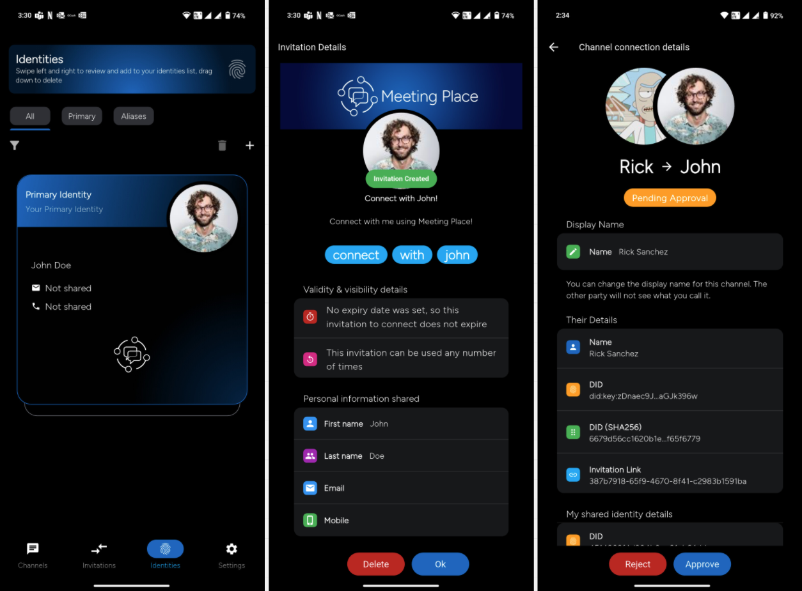

## Key Features

| Feature | Description |
|---------|-------------|
| **Multiple Identities** | Set a primary identity for your main profile, plus create aliases for specific contexts (e.g. a hobbyist persona or professional profile). |
| **Connect with Invitations** | Create and publish invitations with custom options: a custom phrase, a usage limit, or an expiry date. |
| **Secure Messaging** | Individual and group chats with end-to-end privacy built in. |
| **Configurable Chat Transport** | Depending on your use case, use DIDComm, Matrix based transport, or both. DIDComm supports individual chats only and does not support group chats. Use Matrix for group chats and richer chat features like voice messages, message edit, message delete, reactions, and file/document/audio/video attachments. Configure transports with `ENABLED_INDIVIDUAL_CHAT_TRANSPORTS`. |
| **Verified Identity (R-Card and VRC)** | Share your R-Card (a signed digital contact card) in any chat, or initiate a mutual VRC exchange to create a verifiable record of your relationship. See [Feature Demonstrations](#feature-demos). |
| **Messaging Server** | Use the Affinidi-hosted messaging server or bring your own managed mediator. |
| **Human ZKP Demo** | Prove a contact is human using a Zero Knowledge Proof; no biometric data or personal information is shared. See [Feature Demonstrations](#feature-demos). |

For full SDK documentation, see the [Affinidi Meeting Place SDK docs](https://docs.affinidi.com/products/affinidi-messaging/meeting-place/).

### DIDComm Based Transport vs Matrix Based Transport

Individual chats can use DIDComm based transport or Matrix based transport. DIDComm based transport supports individual chats only; group chats require Matrix based transport.

| Feature | DIDComm based transport | Matrix based transport |
|---------|-------------------------|------------------------|
| Individual chat | ✅ | ✅ |
| Group chat | ❌ | ✅ |
| Text messages | ✅ | ✅ |
| Image attachments | ✅<br><sub>Auto downloads</sub> | ✅ |
| File/document attachments | ❌ | ✅ |
| Audio/video attachments | ❌ | ✅ |
| Voice messages | ❌ | ✅ |
| Message edit/delete | ❌ | ✅ |
| Reactions | ✅ | ✅ |
| Typing indicators | ✅ | ✅ |
| Delivery receipts | ✅ | ✅ |
| Visual effects | ✅ | ✅ |
| Contact details update | ✅ | ✅ |
| Presence Indicator | ✅ | ❌ |

> **Note:** When both transports are enabled, the app shows chat transport selection while creating an offer.

## Architecture Overview

The app uses a clean, four layer architecture. Each layer has one job and can only talk to the layer below it.

### Architectural Layers

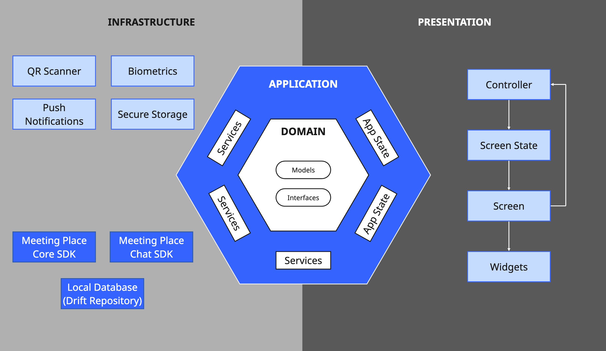

```
Presentation Layer → Application Layer → Domain Layer → Infrastructure Layer
```

### Core Components

#### 1. Presentation Layer (`/lib/presentation/`)
- **Screens**: Individual page implementations for different app features.
- **Widgets**: Reusable UI components and custom widgets.
- **Themes**: App styling and theming configuration.
- **Pure UI**: Contains only view logic, no business logic or state management.

#### 2. Application Layer (`/lib/application/`)
- **Services**: Business logic and use cases.
- **Navigation**: App routing and navigation configuration.
- **State Management**: Riverpod providers for managing application state.

#### 3. Domain Layer (`/lib/domain/`)
- **Models**: Core business entities and value objects.
- **Repository Interfaces**: Contracts for data access.

#### 4. Infrastructure Layer (`/lib/infrastructure/`)
- **Database**: Local storage implementation using Drift.
- **Repositories**: Concrete implementations of domain repository interfaces.
- **Providers**: Riverpod providers for external packages and dependency injection.
- **External Services**: Firebase messaging, biometrics, secure storage, media handling.
- **Configuration**: Environment settings and app configuration.


### Access Rules

Layers can only access the layer directly below them, never skip a level.

| Layer | Responsibility | Can access |
|-------|----------------|------------|
| **Screens** (Presentation) | Display UI, handle user input | Controllers only |
| **Controllers** (State management) | Manage state, coordinate UI ↔ business logic | Services, infrastructure providers |
| **Services** (Application) | Implement business logic and use cases | Repository interfaces, infrastructure providers |

### SDK Integration

| Component | What it does |
|-----------|--------------|
| **Core SDK** | DID management and DIDComm messaging |
| **Chat SDK** | Messaging capabilities |
| **Repository pattern** | Wraps SDK calls behind domain interfaces; swap the SDK without touching UI or business logic |
| **Riverpod providers** | Injects SDK instances throughout the app |

### Chat Screen Architecture

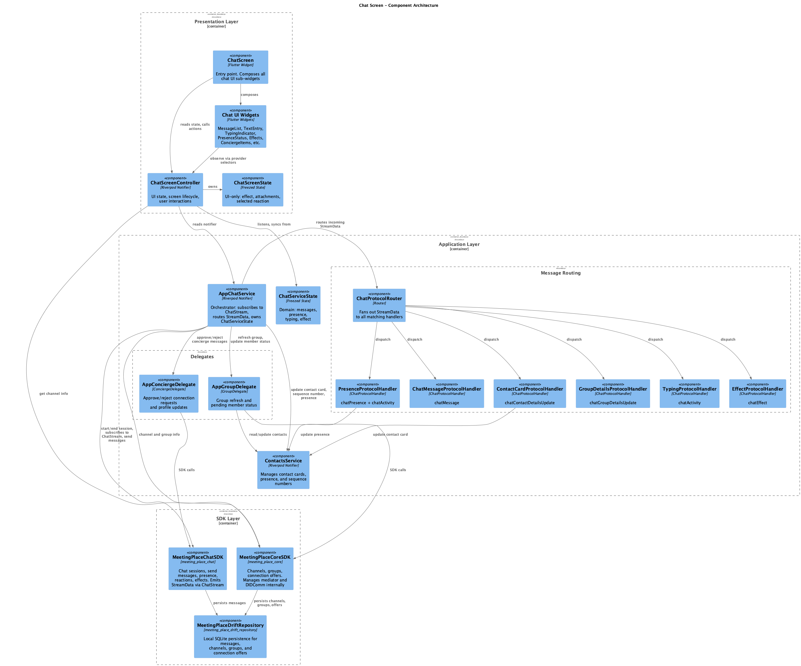

Source diagram: [`assets/docs/chat_screen_architecture.puml`](./assets/docs/chat_screen_architecture.puml)

<h2 id="feature-demos">Feature Demonstrations</h2>

Each tab below documents one interactive feature built into this reference app. Adding a new feature demo = adding a new tab. The page length stays constant regardless of how many demos are included.

<details open id="panel-zkp">
<summary><strong>Human ZKP Demo</strong></summary>

Zero-Knowledge Proof (ZKP) is an optional, privacy-preserving way to prove
"I am human" without sharing biometrics or personal data.

- Feature flag: `ZKP_ENABLED=true`
- Default state: off
- Credentials tab is visible when ZKP is enabled

For the complete guide (architecture, assets, binary size impact,
screenshots, and provider setup), see [doc/ZKP.md](doc/ZKP.md).

</details>

<details id="panel-vrc">
<summary><strong>R-Card and VRC Demo</strong></summary>

<h3 id="vrc-what">What are R-Cards and VRCs?</h3>

The Meeting Place app includes a built-in credential exchange system powered by the **Credentials SDK**. Two types of verifiable credentials are supported:

| Credential | What it encodes | How it is exchanged |
|------------|-----------------|---------------------|
| **Relationship Card (R-Card)** | Your contact information: name, email, phone, company. Signed as a jCard Verifiable Credential (RFC 7095). Exportable to vCard 3.0. | Sent automatically when a channel first opens (inauguration), or shared manually from the chat action menu. |
| **Verifiable Relationship Credential (VRC)** | A mutual "verified relationship" credential encoding the DIDs of both participants and the timestamp of the exchange. | Two-step VDIP handshake: one side requests, the other reciprocates. Both participants receive a signed copy. |

> R-Card and VRC exchange requires no feature flags. Any open channel can exchange credentials. The **Credentials** tab shows all stored R-Cards and VRCs on this device.

> **Integrating into your own app?** See the [Credentials SDK documentation](https://github.com/affinidi/affinidi-meetingplace-sdk-dart/blob/main/meeting-place-credentials.html#rcard-vrc) for the operations API, repository interfaces, and data models.

<h3 id="vrc-rcard">R-Card exchange</h3>

An R-Card is your verifiable digital contact card. The app supports two R-Card flows: automatic sharing when a channel opens, and manual sharing from the chat action menu.

<h4>Automatic flow</h4>

The app automatically sends your R-Card to a new contact when a channel is first opened.

<table>
<tr>
<td align="center" width="33%"><strong>Open a channel</strong></td>
<td align="center" width="33%"><strong>R-Card sent automatically</strong></td>
<td align="center" width="33%"><strong>Contact receives it and saves it</strong></td>
</tr>
<tr>
<td align="center" width="33%">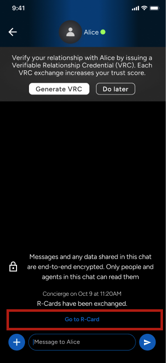</td>
<td align="center" width="33%">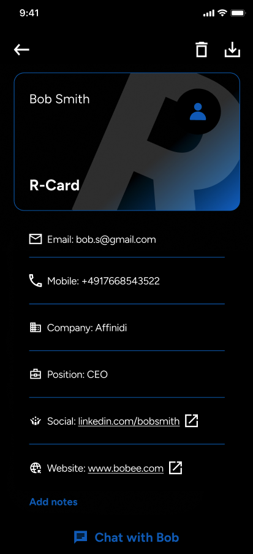</td>
<td align="center" width="33%">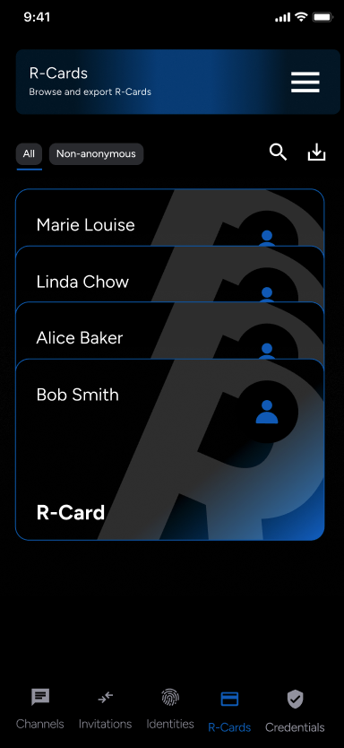</td>
</tr>
</table>

<h4>Manual flow</h4>

You can also share an R-Card at any time from the chat action menu by tapping **+** and selecting **Share R-Card**.

<table>
<tr>
<td align="center" width="33%"><strong>Open chat action menu</strong></td>
<td align="center" width="33%"><strong>Select the R-Card you want to share</strong></td>
<td align="center" width="33%"><strong>Both parties see it in chat</strong></td>
</tr>
<tr>
<td align="center" width="33%">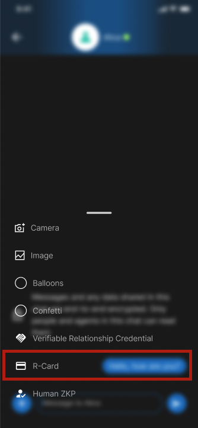</td>
<td align="center" width="33%">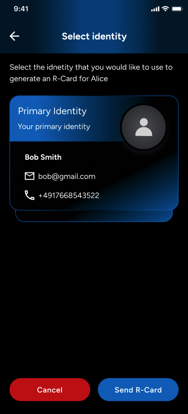</td>
<td align="center" width="33%">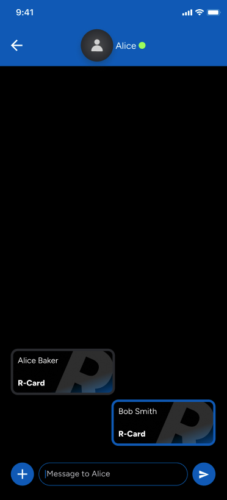</td>
</tr>
</table>

<h3 id="vrc-exchange">VRC exchange</h3>

A VRC is a mutual "verified relationship" credential. Unlike an R-Card, a VRC requires both participants to act: one side initiates a request, and the other reciprocates.

> VRCs establish a trusted record of a relationship that exists independently of any messaging platform. The credential can be verified by anyone without contacting a central authority.

<table>
<tr>
<td align="center" width="20%"><strong>Initiate request</strong></td>
<td align="center" width="20%"><strong>Request sent</strong></td>
<td align="center" width="20%"><strong>Contact prompted</strong></td>
<td align="center" width="20%"><strong>Both sides sign</strong></td>
</tr>
<tr>
<td align="center" width="20%">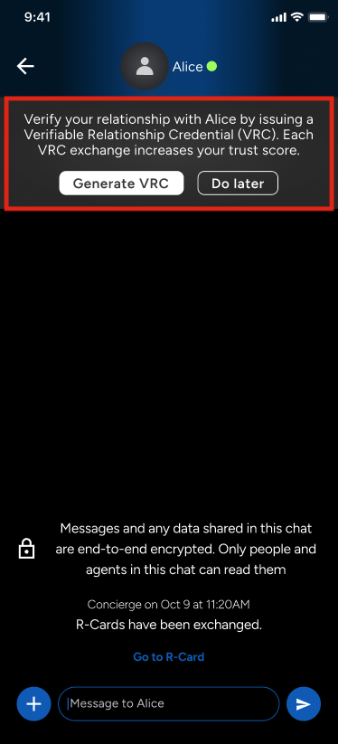</td>
<td align="center" width="20%">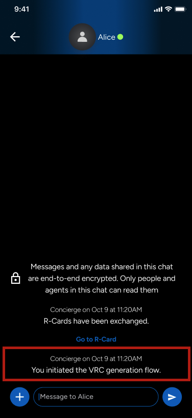</td>
<td align="center" width="20%">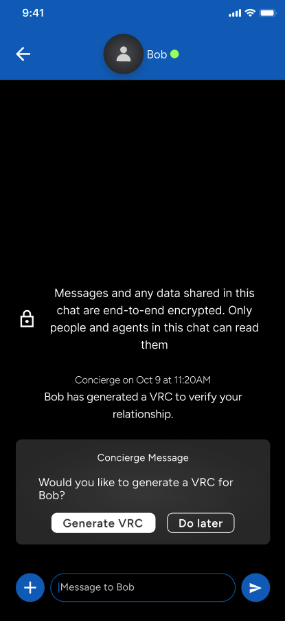</td>
<td align="center" width="20%">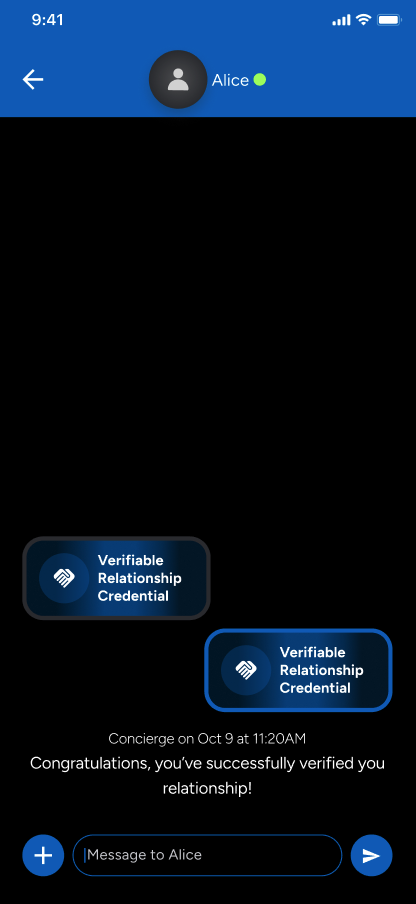</td>
</tr>
</table>

</details>

<details id="panel-matrix">
<summary><strong>Matrix based features</strong></summary>

Matrix enables the richer chat features in this reference app.

| Feature | What it shows |
|---------|---------------|
| **Transport picker** | Test DIDcomm or matrix based chat for individual chat |
| **Group chat** | Create and join Matrix-based group chats. |
| **Voice messages** | Record and play audio messages in chat. |
| **Message actions** | React to messages, edit sent messages, and delete messages. |
| **Media messages** | Share images, videos, files, and documents in chat. |

The screenshots below show the Matrix based chat flow and rich message actions.

<table>
<tr>
<td align="center" width="33%"><strong>Choose transport</strong></td>
<td align="center" width="33%"><strong>Send audio</strong></td>
<td align="center" width="33%"><strong>React to messages</strong></td>
</tr>
<tr>
<td align="center" width="33%">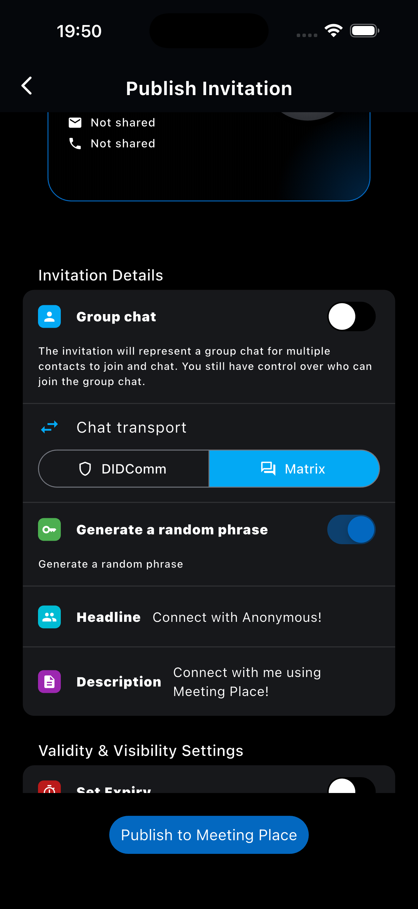</td>
<td align="center" width="33%">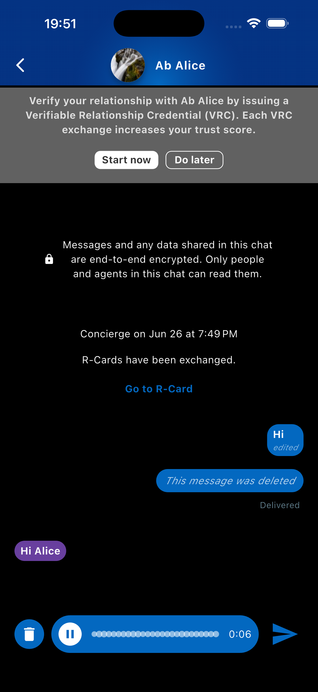</td>
<td align="center" width="33%">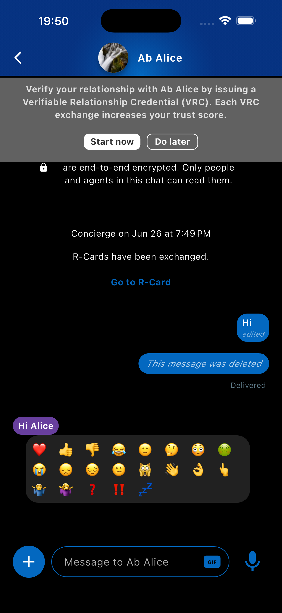</td>
</tr>
</table>
<table>
<tr>
<td align="center" width="33%"><strong>Edit message</strong></td>
<td align="center" width="33%"><strong>Delete message</strong></td>
<td align="center" width="33%"><strong>Group chat</strong></td>
</tr>
<tr>
<td align="center" width="33%">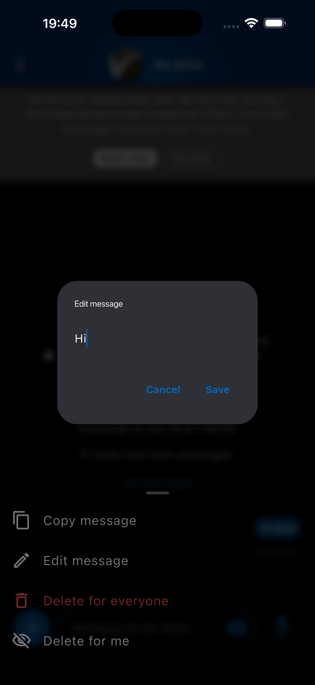</td>
<td align="center" width="33%">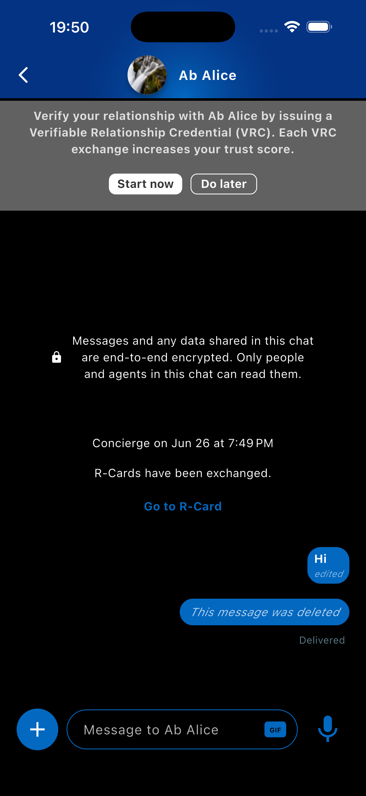</td>
<td align="center" width="33%">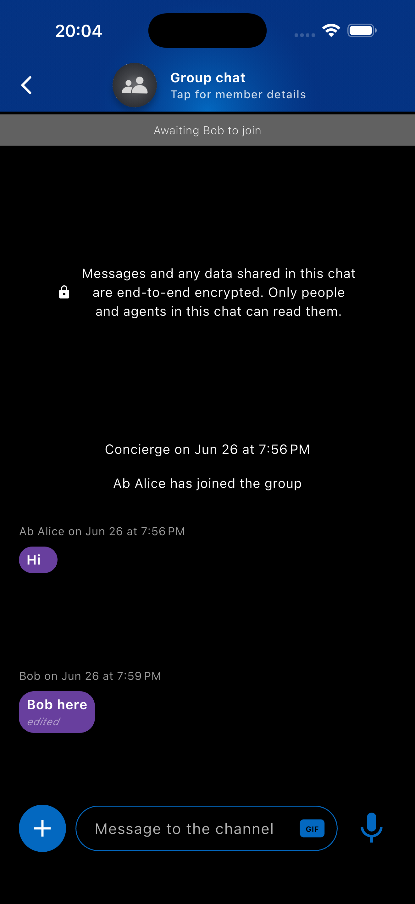</td>
</tr>
</table>

</details>

</details>

## Requirements

| Dependency | Version |
|------------|---------|
| **Flutter** | `3.44.1` |
| **Dart SDK** | `^3.12.0` |

### Matrix E2E Encryption

**Native build requirements, if Matrix is enabled.** This app supports configurable transport protocols (DIDComm, Matrix, or both). If you enable Matrix, it uses `flutter_vodozemac`, a Rust-based implementation of Olm/Megolm encryption, for end-to-end encrypted messaging. If you disable Matrix or use only DIDComm, Rust is not required. See [Environment Variables](#environment-variables) to configure which transports your app uses via `ENABLED_INDIVIDUAL_CHAT_TRANSPORTS`.

**Step 1: Install Rust**

```bash
curl --proto '=https' --tlsv1.2 -sSf https://sh.rustup.rs | sh
. "$HOME/.cargo/env"
```

**Step 2: Add compilation targets**

For iOS:

```bash
rustup target add aarch64-apple-ios aarch64-apple-ios-sim
```

For Android:

```bash
rustup target add aarch64-linux-android armv7-linux-androideabi x86_64-linux-android i686-linux-android
```

> **Note:** Android builds also require NDK, installed via Android Studio (SDK Manager > SDK Tools > NDK).

**If builds fail after `flutter clean`:**

```bash
rm -rf app/build/flutter_vodozemac
fvm flutter run
```

## Getting Started

Set up your environment to run the Meeting Place application.

### Step 1: Activate Melos

```bash
dart pub global activate melos && export PATH="$PATH":"$HOME/.pub-cache/bin"
```

> Add the `export PATH="$PATH":"$HOME/.pub-cache/bin"` line to your shell config (`~/.zshrc` or `~/.bashrc`) so it persists across terminal sessions.

### Step 2: Install dependencies

```bash
melos pubget
```

### Step 3: Generate models

```bash
melos gen
```

### Step 4: Generate localised strings

```bash
melos strings
```

### Step 5: Configure environment variables

See [Environment Variables](#environment-variables) for the full setup.

## Environment Variables

The app uses a `.env` file for configuration. A template is provided.

```bash
mkdir -p configurations && cp templates/.example.env configurations/.env
```

> Run this from the **root folder** of the reference app. Most variables have sensible defaults, only supply values specific to your setup.

### Required Environment Variables

#### Connect to Control Plane API

The Control Plane API enables identity discovery and secure channel creation over DIDComm v2.1. To run it locally, follow the [Control Plane API for Dart](https://docs.affinidi.com/products/affinidi-messaging/meeting-place/deployment-options/control-plane-open-sourced/) guide.

```bash
# Your Control Plane DID (did:web value from your API server)
CONTROL_PLANE_DID=""
```

#### Connect to DIDComm Mediator

The DIDComm Mediator routes messages between parties without reading their content. Follow the [DIDComm Mediator](https://docs.affinidi.com/products/affinidi-messaging/didcomm-mediator/deployment-options/mediator-open-sourced/) guide to set it up.

```bash
# Your Mediator DID
DEFAULT_MEDIATOR_DID=""
```

#### Connect to Matrix Homeserver

The Matrix Homeserver is a messaging server that stores and relays messages between clients using the Matrix protocol.

TBD

Setting up a Matrix Homeserver generates the homeserver URL that you can use to populate the `MATRIX_HOMESERVER` env variable.

```bash
# Required for MeetingPlaceCoreSDK functionality
# Your Matrix Homeserver URL
MATRIX_HOMESERVER=""
```

#### Choose Chat Transports

Use `ENABLED_INDIVIDUAL_CHAT_TRANSPORTS` to choose how individual chats run.

```bash
# DIDComm only. This is the default and does not show a transport picker.
ENABLED_INDIVIDUAL_CHAT_TRANSPORTS='["didcomm"]'

# Matrix only. Requires MATRIX_HOMESERVER.
ENABLED_INDIVIDUAL_CHAT_TRANSPORTS='["matrix"]'

# Test both DIDComm and Matrix. Shows a picker when creating an offer.
ENABLED_INDIVIDUAL_CHAT_TRANSPORTS='["didcomm", "matrix"]'
```

Group chats always use Matrix, so `MATRIX_HOMESERVER` is required for group chat.

#### Enable Push Notifications

Create a [Firebase](https://firebase.google.com/docs/projects/learn-more) project, then:

> **Firebase iOS app**
> 1. [Create an iOS app](https://firebase.google.com/docs/ios/setup#register-app) in your Firebase project.
> 2. Download `GoogleService-Info.plist` from the iOS app settings.
> 3. Copy it to `app/ios/Runner/`. You only need the file, skip the other Firebase setup steps.

> **Firebase Android app**
> 1. [Create an Android app](https://firebase.google.com/docs/android/setup#register-app) in your Firebase project.
> 2. Download `google-services.json` from the Android app settings.
> 3. Copy it to `app/android/app/`. You only need the file, skip the other Firebase setup steps.

```bash
# Firebase - shared
FIREBASE_MESSAGING_SENDER_ID=""
FIREBASE_PROJECT_ID=""
FIREBASE_STORAGE_BUCKET=""

# Firebase - iOS
FIREBASE_IOS_APIKEY=""
FIREBASE_IOS_APP_ID=""
FIREBASE_IOS_BUNDLE_ID=""

# Firebase - Android
FIREBASE_ANDROID_APIKEY=""
FIREBASE_ANDROID_APP_ID=""
```

### Optional Environment Variables

These variables have defaults. Override them only when needed.

```bash
# App configuration
APP_VERSION_NAME=""                              # Default: ""
BIOMETRICS_ENABLED="true"                        # Default: true
DATABASE_LOGGING_ENABLED="false"                 # Default: false (debug builds only)
FOREGROUND_NOTIFICATIONS_ENABLED="false"         # Default: false
TAPS_TO_UNLOCK_DEBUG="7"                         # Default: 7

# Chat settings
CHAT_ACTIVITY_EXPIRES_IN_SECONDS="3"             # Default: 3
CHAT_PRESENCE_SEND_INTERVAL_IN_SECONDS="60"      # Default: 60
CHAT_IMAGE_MAX_SIZE="800"                        # Default: 800 px
CHAT_IMAGE_QUALITY_PERCENT="80"                  # Default: 80%

# Profile settings
PROFILE_IMAGE_MAX_SIZE="100"                     # Default: 100 px
PROFILE_IMAGE_QUALITY_PERCENT="80"               # Default: 80%

# Marketplace
MARKETPLACE_QR_PREFIX=""                         # Default: ""

# Out-of-Band (OOB) flow: distinguishes multiple OOB flows so QR validation does not interfere across flows
DIRECT_INTERACTIVE_OOB_TYPE=""                   # Default: "" (e.g. "oss-app-main-oob-flow")

# Human ZKP & Liveness Credential
ZKP_ENABLED="false"                              # Default: false — enables Human ZKP demo + Credentials tab

# Matrix transport
ENABLED_INDIVIDUAL_CHAT_TRANSPORTS=""            # Default: '["didcomm"]' — use '["matrix"]' for Matrix only or '["didcomm", "matrix"]' to test both. Multiple entries show a picker at offer creation.
MATRIX_MEDIA_MAX_CACHE_MB=""                     # Default: 30 — on-disk media cache limit per Matrix account in megabytes
MATRIX_MEDIA_CACHE_TTL_DAYS=""                   # Default: 30 — how long cached Matrix media files are kept on device
```

> All configuration options and their defaults are defined in `lib/infrastructure/configuration/environment.dart`.

## VSCode Configuration

```bash
mkdir -p .vscode && cp templates/.example.launch.json .vscode/launch.json
```

This configuration points to the correct environment file automatically. Edit `launch.json` to change device IDs, environment files, or other launch parameters.

## Run App on Simulator

Refer to the [Flutter Get Started guide](https://docs.flutter.dev/get-started/install) for setting up your environment to run the app on an iOS Simulator or Android Emulator.

> **For Face Liveness testing, use a physical device.** The camera challenge does not work on simulators or emulators.

## Git Hooks

The repo includes a pre-commit hook at `.githooks/pre-commit` that runs `dart format` and `melos analyze` before every commit.

```sh
git config core.hooksPath .githooks
```

After cloning the repo, run this once to activate it for that clone and all future worktrees created from it.

## Troubleshooting

### Firebase: duplicate app error

> `FirebaseException ([core/duplicate-app] A Firebase App named "[DEFAULT]" already exists)`

**Cause:** The Firebase configuration files and the environment variables in `configurations/.env` do not match.

**Solution:** Ensure the following values are consistent across files:

| Config file | `.env` variable prefix |
|-------------|------------------------|
| `google-services.json` (Android) | `FIREBASE_ANDROID_*` |
| `GoogleService-Info.plist` (iOS / macOS) | `FIREBASE_IOS_*` |
| Both files | `FIREBASE_PROJECT_ID`, `FIREBASE_MESSAGING_SENDER_ID`, `FIREBASE_STORAGE_BUCKET` |

See also: [Firebase duplicate app error reference](https://github.com/firebase/flutterfire/blob/main/packages/firebase_core/firebase_core_platform_interface/lib/src/firebase_core_exceptions.dart#L20-L25).

For AWS Rekognition integration issues, refer to the [Credentials SDK: Provider Setup](https://github.com/affinidi/affinidi-meetingplace-sdk-dart/blob/main/meeting-place-credentials.html#provider-setup) guide.

## Support & Feedback

If you face any issues or have suggestions, [contact us here](https://share.hsforms.com/1afnezgGiQTmkfIT5oxWc8Qea58c).

### Reporting technical issues

1. Search [GitHub Issues](https://github.com/affinidi/affinidi-meetingplace-reference-app/issues) to check if the bug has already been reported.
2. If not, [open a new issue](https://github.com/affinidi/affinidi-meetingplace-reference-app/issues/new). Include a clear title and description, steps to reproduce, and a code sample demonstrating the unexpected behaviour.

## Contributing

Want to contribute? Head over to our [CONTRIBUTING](https://github.com/affinidi/affinidi-meetingplace-reference-app/blob/main/CONTRIBUTING.md) guidelines.
