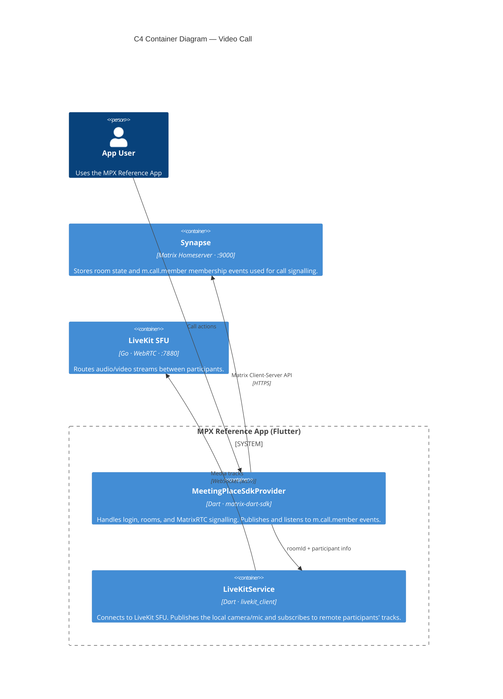
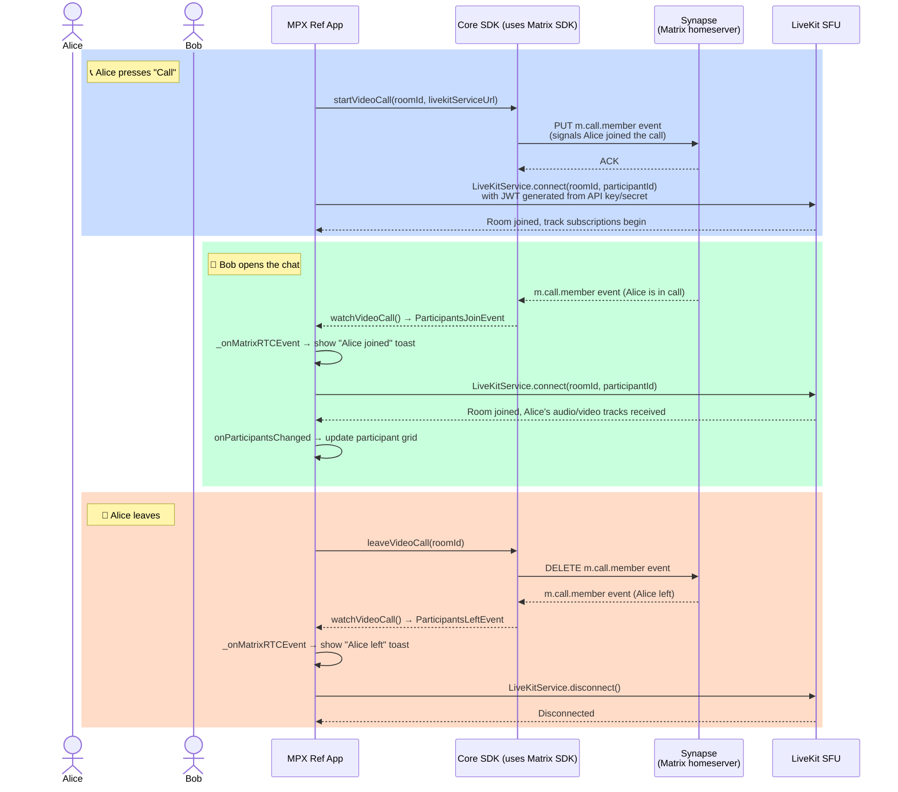

# Video Call — Local Development Setup

This guide explains how to run the full video call feature locally, including what each server does, why both are required, and how to expose them to a physical device via ngrok.

---

## Why two servers?

The video call feature is built on **MatrixRTC**, which combines two separate protocols:

| Server                          | Role                                                                                       | Protocol                         | Default port |
| ------------------------------- | ------------------------------------------------------------------------------------------ | -------------------------------- | ------------ |
| **Synapse** (Matrix homeserver) | Signalling — tracks who is in a call, publishes/receives `m.call.member` membership events | HTTPS / Matrix Client-Server API | `9000`       |
| **LiveKit SFU**                 | Media — routes actual audio and video streams between participants                         | WebSocket + WebRTC               | `7880`       |

They cannot be merged into one:

- Matrix handles identity, room membership, and call signalling. Without it the app cannot log in, create rooms, or discover who joined a call.
- LiveKit is a Selective Forwarding Unit (SFU) that efficiently routes media tracks. Matrix does not carry media, it only tells LiveKit who should be in the room.



---

## MatrixRTC call flow



---

## Prerequisites

- [Docker Desktop](https://www.docker.com/products/docker-desktop/) — to run Synapse and LiveKit
- [ngrok](https://ngrok.com/download) — to expose both servers to a physical iPhone/Android device

---

## Step 1 — Set up and start the backend servers

Clone the matrix server repo:

```bash
git clone https://gitlab.com/affinidi/foundational/genesis/poc/workathons/ai-workathon-2026/affinidi-ai-mpx-matrix
cd affinidi-ai-mpx-matrix
```

Run setup once (initialises Synapse config and git submodules):

```bash
./scripts/setup.sh
```

Start the servers (Synapse + LiveKit via Docker Compose):

```bash
./scripts/start.sh
```

Other useful scripts:

```bash
./scripts/logs.sh      # Tail live logs
./scripts/restart.sh   # Restart after config changes
```

---

## Step 2 — Expose servers via ngrok (especially for physical devices)

> **Skip this step if you are only running on a simulator** — the app defaults to `http://localhost:9000` and `ws://localhost:7880`, which work fine on simulators.

A physical device cannot reach `localhost` on your Mac. ngrok creates public tunnels for both servers in a single agent session.

### Configure ngrok tunnels

> **Why two tunnels in one config?** The free ngrok plan allows only **one agent session**. We need to declare both tunnels in `ngrok.yml` and starting with `ngrok start --all` runs them in a single session. Starting them as separate commands would fail on the second one.

Edit your local ngrok config: `~/.config/ngrok/ngrok.yml` (create it if it doesn't exist):

```yaml
version: "2"
authtoken: <YOUR_NGROK_AUTHTOKEN>
tunnels:
  synapse:
    proto: http
    addr: 9000
    request_header:
      add:
        - "ngrok-skip-browser-warning:true"
  livekit:
    proto: tcp
    addr: 7880
```

Start both tunnels:

```bash
ngrok start --all
```

Verify both servers are running:

1. Open http://localhost:4040/inspect/http from your browser and you will see:

```
https://59d7-119-234-196-33.ngrok-free.app
tcp://0.tcp.ap.ngrok.io:11371
```

2. Or see the URLs printed in the terminal, e.g.:

```
Forwarding  https://xxxx-xx-xx-xx-xx.ngrok-free.app  → http://localhost:9000  (Synapse)
Forwarding  tcp://0.tcp.ap.ngrok.io:XXXXX             → localhost:7880         (LiveKit)
```

### Update Synapse's public base URL

Edit `affinidi-ai-mpx-matrix/files/homeserver.yaml` and update `public_baseurl` to your current Synapse ngrok HTTPS URL:

```yaml
public_baseurl: "https://xxxx-xx-xx-xx-xx.ngrok-free.app"
```

Then restart Synapse so it picks up the change:

```bash
./scripts/restart.sh
```

---

## Step 3 — Configure the Flutter app

Copy the template if you haven't already:

```bash
cp templates/.example.env configurations/.env
```

Update `configurations/.env` with your values:

```bash
# Override both when testing on a physical device:
MATRIX_HOMESERVER="https://xxxx-xx-xx-xx-xx.ngrok-free.app"
# Note that ngrok gives `tcp:` protocol, when pasting here, replace it with `ws:` instead
LIVEKIT_URL="ws://0.tcp.ap.ngrok.io:XXXXX"

# These should match the keys configured in `affinidi-ai-mpx-matrix/livekit.yaml`
LIVEKIT_API_KEY="<key>"
LIVEKIT_API_SECRET="<secret>"

# ... fill in the other variables
```

> **Note:** ngrok URLs change every time you restart the agent on a free plan. You'll need to repeat Step 2 and update `MATRIX_HOMESERVER`, `LIVEKIT_URL`, and `files/homeserver.yaml` after each restart.

---

## Step 4 — Run the app

---

## Troubleshooting

| Symptom                                                            | Likely cause                                                                                                   | Fix                                                                              |
| ------------------------------------------------------------------ | -------------------------------------------------------------------------------------------------------------- | -------------------------------------------------------------------------------- |
| `publishOffer` fails on device                                     | `MATRIX_HOMESERVER` still points to `localhost`                                                                | Update `.env` with current ngrok HTTPS URL                                       |
| LiveKit connect fails on device                                    | `LIVEKIT_URL` uses `tcp://` prefix                                                                             | Must be `ws://`, e.g. `ws://0.tcp.ap.ngrok.io:XXXXX`                             |
| `ngrok start --all` fails on second tunnel                         | Two separate ngrok agents running                                                                              | Kill existing: `pkill ngrok`, then `ngrok start --all`                           |
| Synapse returns 404 after ngrok restart                            | Old URL still in `homeserver.yaml`                                                                             | Update `public_baseurl` + `./scripts/restart.sh`                                 |
| Participants don't appear in grid                                  | LiveKit `--node-ip` mismatch                                                                                   | For simulator use `--node-ip 127.0.0.1`; for device expose via ngrok TCP         |
| `Connection closed before full header was received` on LiveKit URL | LiveKit container not running — volume path for `livekit.yaml` fails if scripts are not run from the repo root | In the `affinidi-ai-mpx-matrix` repo, open terminal and run `./scripts/start.sh` |
