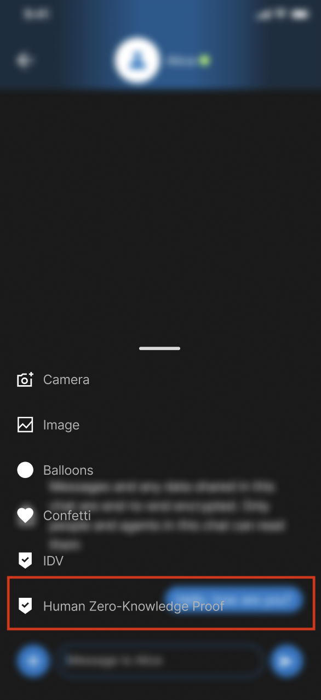
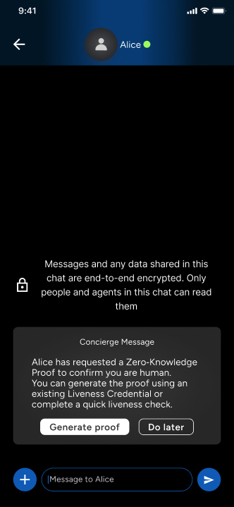
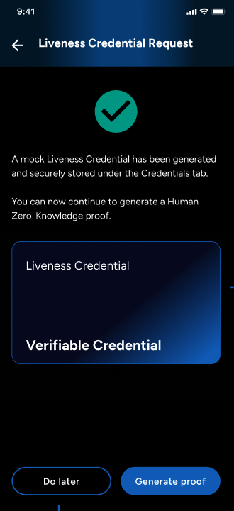
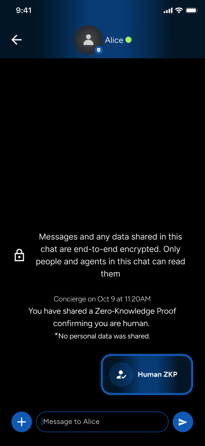
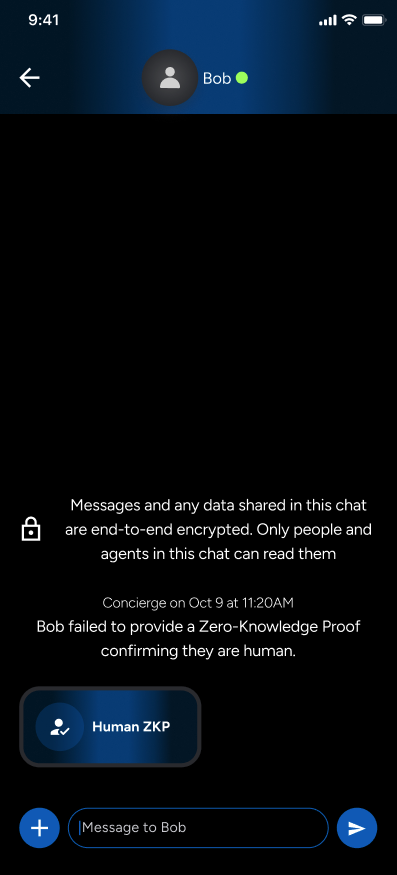

# Human ZKP (Opt-in)

This document contains the complete reference guide for the Human ZKP flow used in this app.

## What is a Zero Knowledge Proof?

A **Zero-Knowledge Proof (ZKP)** lets one party prove a fact to another without revealing the underlying data. In this app, the fact being proved is: *"I am a real human."* The proof is derived from a **Liveness Credential**; a signed Verifiable Credential issued after a liveness check and packaged as a compact **Groth16 ZKP** that can be verified instantly by the other party.

## Enabling the demo

The Human ZKP demo is **off by default**. Enable it at build or run time:

```bash
ZKP_ENABLED=true
```

## Required dependencies and assets for opt-in

If you want to opt in to the Human ZKP flow in your own app, ensure these dependencies and assets are present.

Required libraries:

- `circom_witnesscalc`
- `flutter_rapidsnark`
- `meeting_place_credentials`
- `vc_zkp`

Required assets:

- `assets/zkp/SimpleVCProof.groth16.zkey`
- `assets/zkp/SimpleVCProof.wcd`
- `assets/zkp/SimpleVCProof.groth16.vkey.json`

And in `pubspec.yaml`, include:

```yaml
flutter:
  assets:
    - assets/zkp/
```

> Setting `ZKP_ENABLED=true` also unlocks the **Credentials** tab, where you can inspect and manage Liveness Credentials.

> Out of the box the demo uses **synthetic liveness evidence**, no camera or third-party service needed. To connect a real face detection service, see [Using a real liveness provider](#using-a-real-liveness-provider).

## Binary size impact

This demo currently ships Groth16 proving assets inside the app bundle for offline-first proof generation:

- `assets/zkp/SimpleVCProof.groth16.zkey`
- `assets/zkp/SimpleVCProof.wcd`
- `assets/zkp/SimpleVCProof.groth16.vkey.json`

Total ZKP proving assets: (~7.28 MiB), which increases install artifact size by roughly this amount before platform-level compression.

We intentionally keep these files bundled in the reference app to ensure deterministic, offline demo behavior and avoid first-run network/setup failures. Production apps can move the `.zkey` to first-use download plus on-device cache if minimizing initial binary size is a higher priority than offline readiness.

## Happy path

The screenshots below show the full flow from the requester's side.

<table>
<tr>
<td align="center" width="25%"><strong>Open chat</strong><br><sub>Start a peer-to-peer conversation</sub></td>
<td align="center" width="25%"><strong>Send ZKP request</strong><br><sub>Tap <b>'+'</b> to start Human ZKP flow</sub></td>
<td align="center" width="25%"><strong>Contact completes liveness</strong></td>
<td align="center" width="25%"><strong>ZKP sent and verified</strong></td>
</tr>
</table>

<table>
<tr>
<td align="center" width="25%"><br><sub>Step 1</sub></td>
<td align="center" width="25%"><br><sub>Step 2</sub></td>
<td align="center" width="25%"><br><sub>Step 3</sub></td>
<td align="center" width="25%"><br><sub>Step 4</sub></td>
</tr>
</table>

## Failure path

If verification fails, a **Concierge message** appears in the thread with a Human ZKP badge:

> *"Bob failed to provide a Zero Knowledge Proof confirming they are human."*

<p align="center">

</p>

## Using a real liveness provider

The liveness check in this reference app is **mocked with synthetic evidence**; it exercises the full **Liveness Credential -> ZKP pipeline** end-to-end without a camera or third-party account, so you can run the demo immediately after cloning.

The detailed pipeline architecture, provider integration guide, and AWS Rekognition setup instructions live in the **[Credentials SDK documentation](https://github.com/affinidi/affinidi-meetingplace-sdk-dart/blob/main/meeting-place-credentials.html#provider-setup)**.

> **Recommended provider - AWS Rekognition Face Liveness.** Our team has end-to-end validated this integration against the Liveness Credential pipeline. See [Credentials SDK; Provider Setup](https://github.com/affinidi/affinidi-meetingplace-sdk-dart/blob/main/meeting-place-credentials.html#provider-setup).

> **Prefer a different service?** The pipeline is provider-agnostic. Azure Face API, Onfido, or any custom liveness solution will work. Implement `LivenessEvidenceSource` and the credential and ZKP layers require zero changes.

### AWS Rekognition Face Liveness setup

This section documents everything required to configure **Amazon Rekognition Face Liveness** for use with a Flutter app via the [`face_liveness_detector`](https://github.com/affinidi/affinidi-meetingplace-reference-app/blob/main/packages/face_liveness_detector/README.md) plugin. An end-to-end proof-of-concept validated this flow against the Liveness Credential pipeline above. The AWS integration itself is not part of the reference app and should be implemented in your own project or SDK layer.

#### Overview

AWS Face Liveness works in three steps:

1. **Create session**: call `CreateFaceLivenessSession` to obtain a `sessionId`.
2. **Camera challenge**: present the native Amplify Face Liveness UI, which streams video to Rekognition for the given session.
3. **Fetch results**: call `GetFaceLivenessSessionResults` to read the session status and confidence score.

Authentication uses a **Cognito Identity Pool** with guest (unauthenticated) access. No user sign-in is required. The mobile client obtains temporary AWS credentials and calls Rekognition directly, or via a backend you control.

#### AWS prerequisites

1. An **AWS account** with [Amazon Rekognition Face Liveness](https://docs.aws.amazon.com/rekognition/latest/dg/face-liveness.html) available in your chosen region (for example, `us-east-1`).
2. A **Cognito Identity Pool** with **Enable access to unauthenticated identities** turned on.
3. An **IAM policy** on the unauthenticated role granting Rekognition Face Liveness API access:

```json
{
  "Version": "2012-10-17",
  "Statement": [
    {
      "Effect": "Allow",
      "Action": [
        "rekognition:CreateFaceLivenessSession",
        "rekognition:GetFaceLivenessSessionResults"
      ],
      "Resource": "*"
    }
  ]
}
```

4. Note your **Identity Pool ID** (format `region:uuid`) and **region**. Both are required for Amplify configuration.

For a guided walkthrough, see the [AWS Amplify Face Liveness quick start](https://ui.docs.amplify.aws/swift/connected-components/liveness#quick-start).

#### AWS console setup

1. Open **Amazon Cognito** -> **Identity pools** -> **Create identity pool**.
2. Enable **Guest access** (unauthenticated identities).
3. Create or select the IAM role for unauthenticated users and attach the Rekognition policy above.
4. Copy the **Identity pool ID** (for example, `us-east-1:xxxxxxxx-xxxx-xxxx-xxxx-xxxxxxxxxxxx`).
5. Confirm Face Liveness is supported in your region.

**Alternative: Amplify CLI**

```bash
amplify init
amplify add auth    # choose Identity Pool with unauthenticated access
amplify push
```

A reference Amplify project lives at `packages/face_liveness_detector/example/android/amplify/`.

#### Amplify configuration

The native Face Liveness UI reads Amplify config from platform-specific files. Both must reference the same Identity Pool ID and region.

**`amplifyconfiguration.json`:**

```json
{
  "auth": {
    "plugins": {
      "awsCognitoAuthPlugin": {
        "IdentityManager": { "Default": {} },
        "CredentialsProvider": {
          "CognitoIdentity": {
            "Default": {
              "PoolId": "us-east-1:REPLACE_WITH_IDENTITY_POOL_ID",
              "Region": "us-east-1"
            }
          }
        },
        "CognitoIdentity": {
          "Default": {
            "PoolId": "us-east-1:REPLACE_WITH_IDENTITY_POOL_ID",
            "Region": "us-east-1"
          }
        }
      }
    }
  }
}
```

**File locations:**

| Platform | Path |
|----------|------|
| iOS | `ios/amplifyconfiguration.json` and `ios/awsconfiguration.json` (add both to the Xcode Runner target) |
| Android | `android/app/src/main/res/raw/amplifyconfiguration.json` |

Example templates are in `packages/face_liveness_detector/example/ios/` and the [package README](https://github.com/affinidi/affinidi-meetingplace-reference-app/blob/main/packages/face_liveness_detector/README.md).

If your integration also calls Rekognition from Dart (session creation and results fetch), configure Amplify Auth separately with the same pool ID and region, either programmatically or via the same JSON files.

#### Native platform setup

##### iOS

1. Place `amplifyconfiguration.json` and `awsconfiguration.json` in the `ios/` directory and add them to the Xcode Runner target.
2. Add Swift Package dependencies to the Runner target:
   - [amplify-swift](https://github.com/aws-amplify/amplify-swift) `2.46.1+` with products `Amplify` and `AWSCognitoAuthPlugin`
   - [amplify-ui-swift-liveness](https://github.com/aws-amplify/amplify-ui-swift-liveness) `1.3.5+` with product `FaceLiveness`
3. Call `Amplify.configure()` during app startup (before presenting the liveness widget).
4. Declare camera usage in `Info.plist`:

```xml
<key>NSCameraUsageDescription</key>
<string>Camera access is required for face liveness verification.</string>
```

5. Minimum deployment target: iOS 13.0+ (16.0+ recommended).

See [`packages/face_liveness_detector/ios/setup_dependencies.md`](https://github.com/affinidi/affinidi-meetingplace-reference-app/blob/main/packages/face_liveness_detector/ios/setup_dependencies.md) for detailed Xcode steps.

##### Android

1. Place `amplifyconfiguration.json` in `android/app/src/main/res/raw/`.
2. Set `minSdkVersion` to at least **24** and `compileSdkVersion` to **35**.
3. Extend `FlutterFragmentActivity` instead of `FlutterActivity`:

```kotlin
import io.flutter.embedding.android.FlutterFragmentActivity

class MainActivity : FlutterFragmentActivity()
```

4. Declare camera permission in `AndroidManifest.xml`:

```xml
<uses-permission android:name="android.permission.CAMERA" />
```

5. The `face_liveness_detector` plugin configures Amplify on attach and pulls in the native Amplify Face Liveness dependencies.

> Use a **physical device** for Face Liveness. The camera challenge does not work reliably on emulators or simulators.

#### Session lifecycle

Once AWS and native setup are complete, integrate the liveness check in your app:

1. **Create a session**: from your backend or directly from the client using temporary Cognito credentials:

```text
RekognitionService.CreateFaceLivenessSession
-> { "SessionId": "..." }
```

2. **Run the camera challenge**: pass the session ID and region to the Flutter widget:

```dart
FaceLivenessDetector(
  sessionId: sessionId,
  region: 'us-east-1',
  onComplete: () { /* fetch results */ },
  onError: (code) { /* handle error */ },
)
```

3. **Fetch results**: after `onComplete`, call:

```text
RekognitionService.GetFaceLivenessSessionResults
-> { "Status": "SUCCEEDED", "Confidence": 95.3, ... }
```

4. **Map to evidence**: convert the result into provider-neutral evidence for your credential layer:

| Field | AWS source |
|-------|------------|
| `providerId` | `"aws_rekognition"` |
| `providerTransactionId` | `SessionId` |
| `livenessScore` | `Confidence` |
| `livenessThreshold` | Your configured minimum (for example, `80.0`) |
| `checkedAt` | Timestamp when results were fetched |

A working Flutter example with backend session creation is in `packages/face_liveness_detector/example/`.
